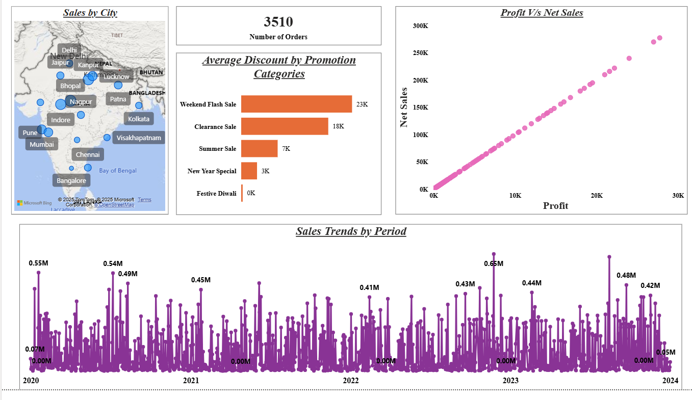
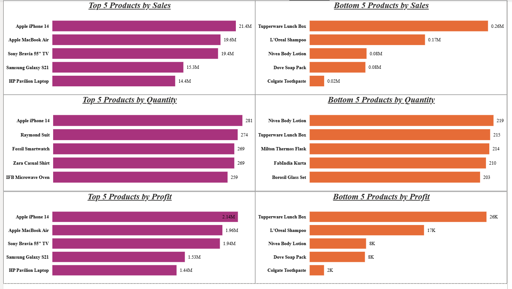
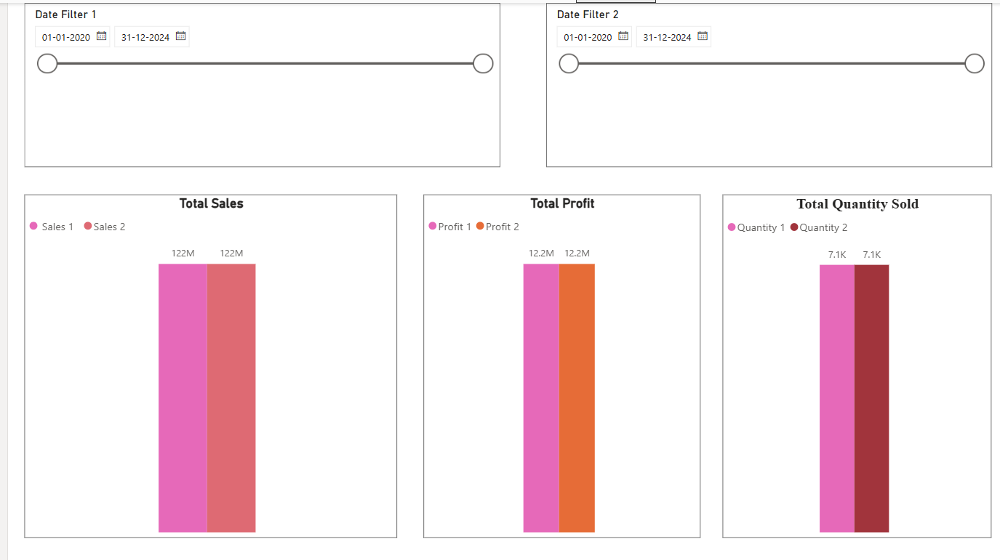

# 📊 Sales Analysis Dashboard (Power BI)

This project provides an **interactive Power BI dashboard** to analyze sales performance, promotions, profit trends, and customer transactions.  
It enables businesses to track **KPIs, discounts, and transaction-level data** effectively.

---

## 🚀 Features
- **Sales by City** – Geographical distribution of sales across India.
- **Discounts by Promotion Category** – Impact of campaigns like Weekend Flash Sale, Summer Sale, and Festive offers.
- **Profit vs Net Sales** – Scatter plot comparing profitability with revenue.
- **Sales Trends over Time** – Historical trend line for total sales from 2020–2024.
- **KPI Cards** – Total Sales, Profit, and Quantity Sold.
- **Interactive Filters** – Date range, product, promotion, and customer filters.
- **Detailed Transaction Table** – Order-level details with discounts, profit, and units sold.

---

## 🎥 Demo Video / GIF

👉 Watch the dashboard in action:  

  

Or add a GIF preview here:  

---

## 📷 Dashboard Previews
### 1️⃣ Sales Overview

### 2️⃣ KPIs and Filters

### 3️⃣ Transaction Data

---

## 🛠️ Tools Used
- **Power BI Desktop**
- **Data Modeling (DAX, Relationships)**
- **Interactive Visualizations**
